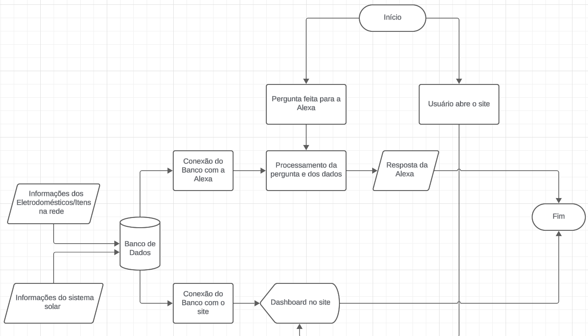

# Sprint-03---Pensamento-Computacional-e-SERS

## Solar Pulse
Nome: Guilherme Spranger dos Santos -> RM: 564059

Nome: Gustavo Lemos Diógenes -> RM: 565579

Nome: Pedro Paulo Barbosa Ross -> RM: 563038

Nome: Samuel de Souza Jorge -> RM: 558966

## Integração dos componentes

## Justificativa técnica das escolhas

Dentre as escolhas feitas por projeto, optamos por utilizar a Alexa como assistente virtual base por conta de sua facilidade de configuração através das Skills, além de ser um LLM já utilizado por grande parte dos usuários no quesito de automação residencial, o que facilita e amplia sua implementação sem a necessidade de diversos hardwares extras.

Em relação a linguagem de programação, optamos pelo uso de Python, pois, além de ser uma linguagem simples e eficiente, permitindo o desenvolvimento de aplicações de forma prática, também é uma das linguagens mais utilizadas para análise de dados, o que é um grande facilitador para o ponto central do projeto, sendo a análise de consumo.

## Resultados e dados funcionais apresentados

Como resultado do nosso projeto, tivemos um meio facilitado do usuário de verificar seus dados referentes ao consumo energético, permitindo, através de dashboards e gráficos, além da própria Alexa, a visualização do consumo energético e da geração, além de permitir a manipulação dos dispositivos na rede, permitindo um controle e gastos mais eficientes.

## Conexões com as disciplinas

Analisando o projeto e todo o seu desenvolvimento, conseguimos perceber como ele se correlaciona com ambas as disciplinas.

Em relação a disciplina de Pensamento Computacional, podemos ver que o projeto se conecta principalmente em sua estrutura de programação, por grande parte ser feita em Python, se utilizando de bibliotecas e técnicas para um desenvolvimento prático e eficiente.

Já por outro lado, podemos ver que a disciplina de SERS se conecta, principalmente, na parte de análise e predição do consumo de energia, utilizando de conteúdos vistos em sala de aula, juntamente com a programação em Python, para realizar o aprendizado de máquina que é a base do projeto.
